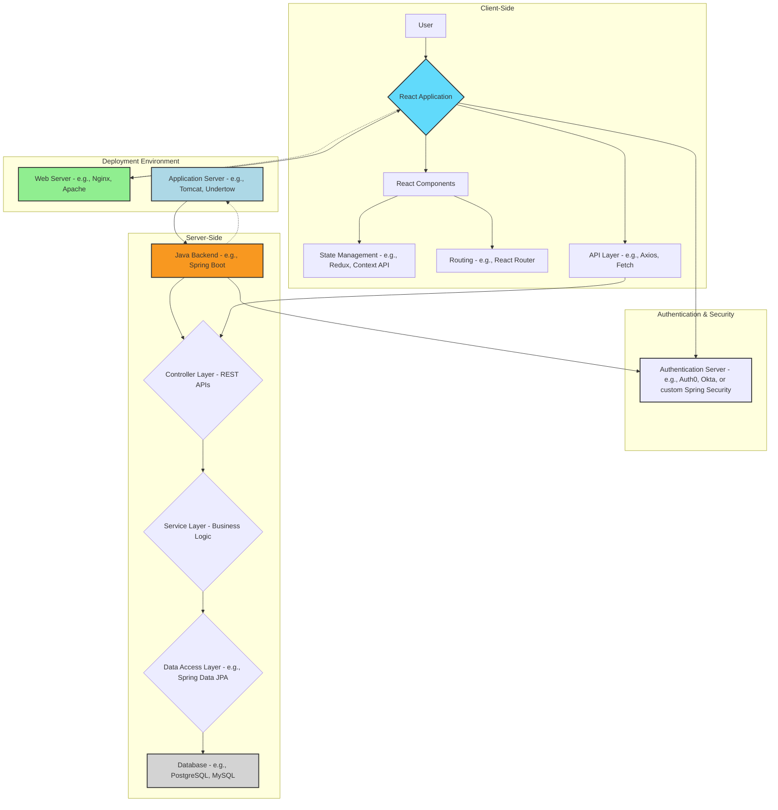

```mermaid
flowchart TD
    subgraph "Client-Side"
        B{"React Application"}
        A["User"]
        C["React Components"]
        D["State Management - e.g., Redux, Context API"]
        E["Routing - e.g., React Router"]
        F["API Layer - e.g., Axios, Fetch"]
    end

    subgraph "Deployment Environment"
        L["Web Server - e.g., Nginx, Apache"]
        M["Application Server - e.g., Tomcat, Undertow"]
    end

    subgraph "Authentication & Security"
        O["Authentication Server - e.g., Auth0, Okta, or custom Spring Security"]
    end

    subgraph "Server-Side"
        H{"Controller Layer - REST APIs"}
        G["Java Backend - e.g., Spring Boot"]
        I{"Service Layer - Business Logic"}
        J{"Data Access Layer - e.g., Spring Data JPA"}
        K["Database - e.g., PostgreSQL, MySQL"]
    end

    A --> B
    B --> C & F & O
    C --> D & E
    G --> H & O
    H --> I
    I --> J
    J --> K
    L --> B
    M --> G
    B -.-> L
    G -.-> M
    F --> H

    style B fill:#61DAFB,stroke:#333,stroke-width:2px
    style G fill:#f89820,stroke:#333,stroke-width:2px
    style K fill:#d3d3d3,stroke:#333,stroke-width:2px
    style L fill:#90ee90,stroke:#333,stroke-width:2px
    style M fill:#add8e6,stroke:#333,stroke-width:2px
    style O fill:#lightgrey,stroke:#333,stroke-width:2px
```
